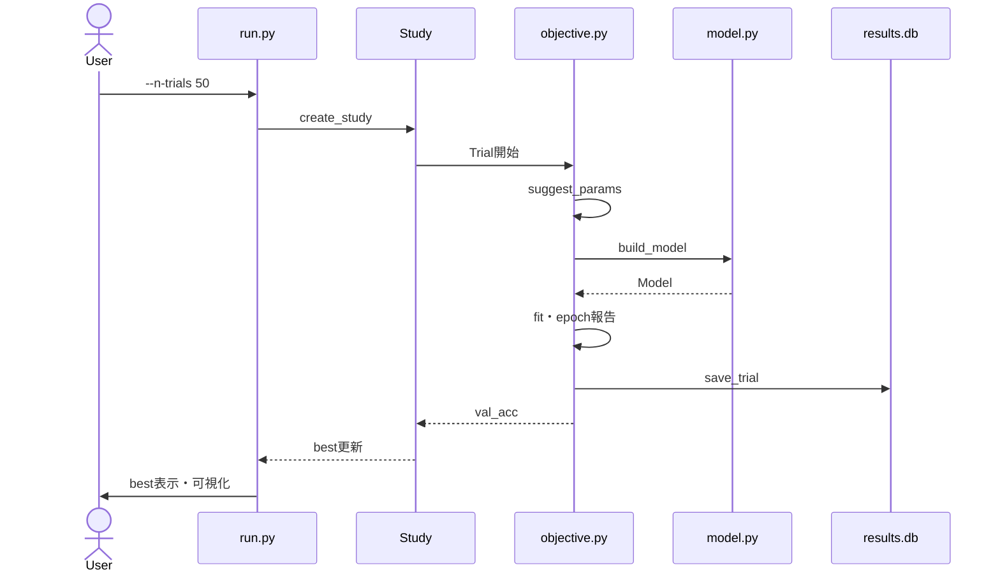

# 2. シーケンス図 — 1 Trialのモジュール間通信 (cnnOptimizer)

```mermaid
sequenceDiagram
    actor User
    participant Run as run.py
    participant Optuna as Study
    participant Obj as objective.py
    participant Model as model.py
    participant DB as results.db

    User->>Run: --n-trials 50
    Run->>Optuna: create_study
    Optuna->>Obj: Trial開始
    Obj->>Obj: suggest_params
    Obj->>Model: build_model
    Model-->>Obj: Model
    Obj->>Obj: fit・epoch報告
    Obj->>DB: save_trial
    Obj-->>Optuna: val_acc
    Optuna-->>Run: best更新
    Run->>User: best表示・可視化
```
