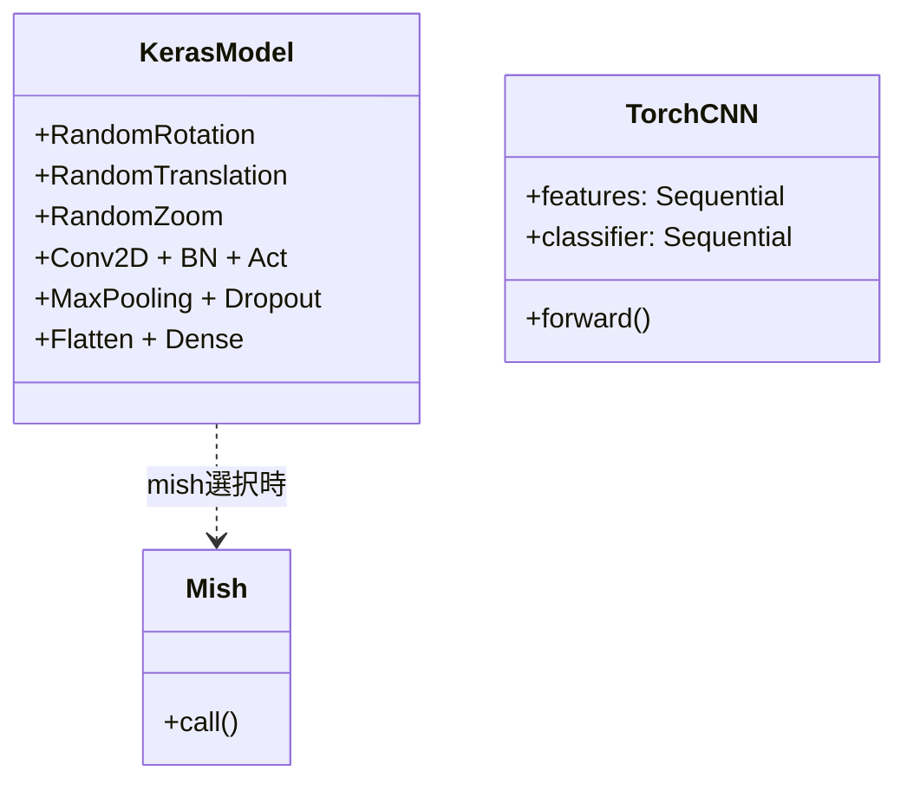

# 3a. クラス図 — モデル構造 (cnnOptimizer)

```mermaid
classDiagram
    class KerasModel {
        +RandomRotation
        +RandomTranslation
        +RandomZoom
        +Conv2D + BN + Act
        +MaxPooling + Dropout
        +Flatten + Dense
    }
    class Mish {
        +call()
    }
    class TorchCNN {
        +features: Sequential
        +classifier: Sequential
        +forward()
    }
    KerasModel ..> Mish : mish選択時
```
