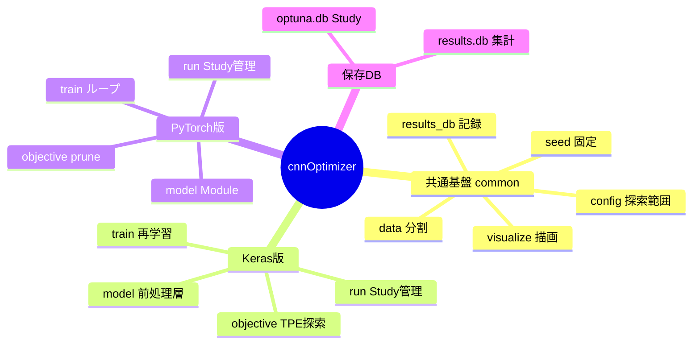

# 4. マインドマップ — プロジェクト構成 (cnnOptimizer)

```mermaid
mindmap
  root((cnnOptimizer))
    共通基盤 common
      config 探索範囲
      data 分割
      seed 固定
      results_db 記録
      visualize 描画
    Keras版
      model 前処理層
      objective TPE探索
      run Study管理
      train 再学習
    PyTorch版
      model Module
      train ループ
      objective prune
      run Study管理
    保存DB
      optuna.db Study
      results.db 集計
```
