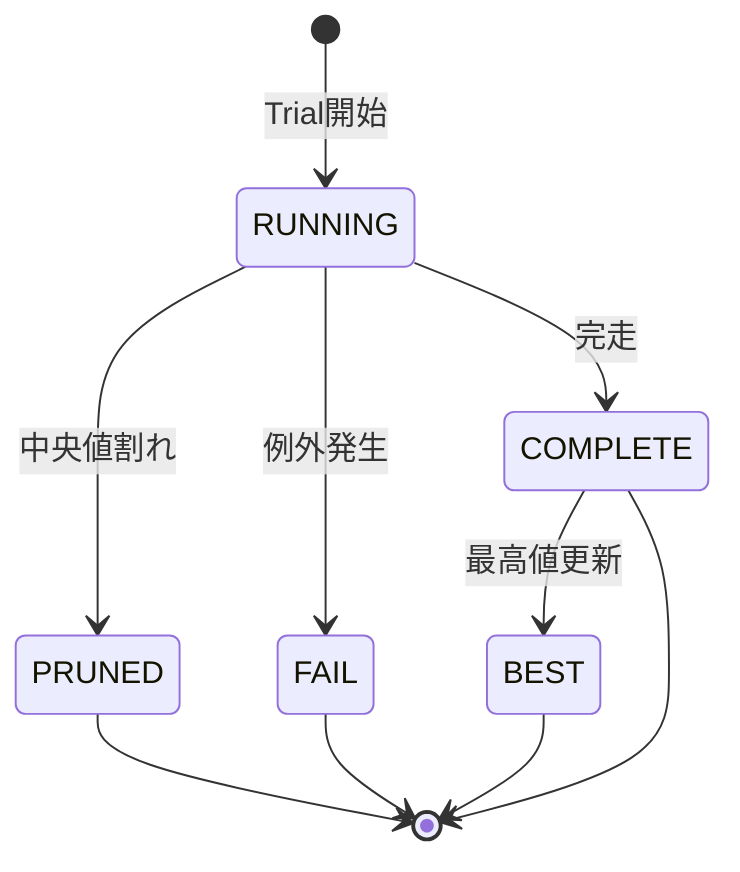

# 5. 状態図 — Trialのライフサイクル (cnnOptimizer)

```mermaid
stateDiagram-v2
    [*] --> RUNNING: Trial開始
    RUNNING --> PRUNED: 中央値割れ
    RUNNING --> FAIL: 例外発生
    RUNNING --> COMPLETE: 完走
    PRUNED --> [*]
    FAIL --> [*]
    COMPLETE --> BEST: 最高値更新
    BEST --> [*]
    COMPLETE --> [*]
```
